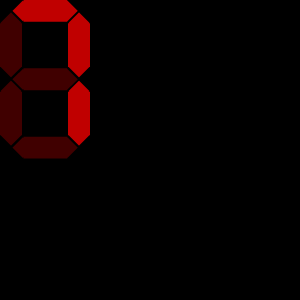

# 7-Segment display

A classic 7-display component.
You can pass it a char map to a combination of activated segments.

**index.gui**

```
<svg>
  <defs>
    <link rel="stylesheet" href="fitbit-widgets/7-segment-display/index.css" />
    <link rel="import" href="fitbit-widgets/7-segment-display/index.gui" />
  </defs>
  <use id="display" href="#7-segment-display" />
</svg>
```

**index.css**

```css
.on {
	fill: #c00000;
}

.off {
	fill: #400000;
}
```

```typescript
import { byId } from 'fitbit-widgets/dist/document';
import segmentDisplay from 'fitbit-widgets/dist/7-segment-display';
import digits from 'fitbit-widgets/dist/7-segment-display/digits';

const displayElement = segmentDisplay(byId('display'), {
	charMap: digits,
	height: 205,
	width: 110,
	visible: true,
	value: '7',
	updateSegment: (segment, on) => {
		segment.class = on ? 'on' : 'off';
	},
});

displayElement.value = '9';
```

# Screenshot


