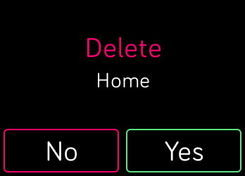

# Confirm dialog

Based in the [`ActionDialog`](https://dev.fitbit.com/build/guides/design-guidelines/ui-components/#action-dialog).
It allows you to prompt a dialog in top of your current view, asking to the user for make a decission.
You can see the available options [in the sourcecode](../index.ts).

# Screenshot

