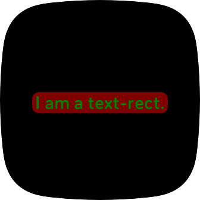

# text-rect

A `<Text>` inside a `<Rect>`. The `<Rect>` automatically resizes to accommodate the `<Text>`.

# Screenshot



# Usage

**index.view**

```xml
<svg>
  <defs>
    <link rel="import" href="fitbit-widgets/text_rect/index.defs" />
  </defs>
  <use id="myTextRect" href="#text-rect" />
</svg>
```

**index.css**

```css
#myTextRect {
	x: 50%;
	y: 35;
}

#myTextRect #text {
	text-anchor: middle;
	font-size: 40;
	text-buffer: 'I am a text-rect.';
	fill: green;
}

#myTextRect #rect {
	opacity: 0.3;
	rx: 20;
	ry: 20;
	fill: red;
}

#myTextRect #config {
	text-buffer: 'padding-left: 5; padding-right: 5; padding-top: -3; padding-bottom: 2;';
}
```

**index.js**

```javascript
import 'fitbit-widgets/dist/text_rect';

const myTextRectEl = document.getElementById('myTextRect');
myTextRectEl.text = 'New text.';
```

# Demo

There are many other ways to use text-rect. See [here](https://github.com/gondwanasoft/fitbit-text-rect) for examples.
